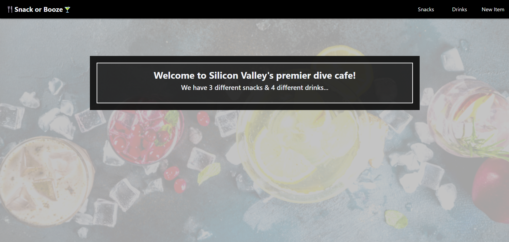

# React Snack or Booze 



## Description: 

[Try it out](https://pasha-log.github.io/react-2-assessment/)

Until a week ago (hypothetically), I was the lead developer at Silicon Valley’s hottest coding cafe, “The Closure Cafe”. I had a nice React app that listed my food items drawing those from a static list of items hard-coded into my app.

Now, though, the cafe has gotten its liquor license and relaunched itself as “Snack or Booze”, and the app needed to change!

* The homepage should show the # of food items (“snacks”) and drink choices (“drinks”)
* The navbar should add a new link, “Drinks”, leading to a page listing the drinks — just like the “Snacks” link leads to a page listing food items.
* The drink listing page should show a list of drink choices, with each being a link to the details about the drink, just like for food items.
* However, I shouldn’t have solved this by just cloning the FoodMenu and FoodItem components — I’d have so much duplicate code! Instead, I turned these into generic components that can work with either food or drink lists/items.
* Now that I have more things on my menu, I added a page that lets site users add either a drink or a snack.

The original project was included with a node library, json-server, which creates a straightforward fully-featured JSON REST API from a JSON file, including the ability to update that JSON file when changes are made via POST/PATCH/DELETE. When you add drinks/snacks, you’re changing the file db.json in the application directory.

json-server is terrific for working on front-end code challenges that would benefit from a simple backend API, or small-scale personal projects where a custom backend server would be overkill. However, in order to be create a version that could be deployed to gh-pages I had to refactor the API logic to use localStorage instead of json-server. 

This repository was an assessment in my Springboard SWE Track, so the other two files conceptual.md and unroll are included. conceptual.md contains questions I had to answer regarding React history and React router. And unroll was a function I had to write for pre-interview problem solving practice. 

I had to write a function called *unroll*, which takes in a square array of arrays (i.e. a grid with n rows and n columns). An input could look like this:

```
const square = [
  [1, 2, 3, 4],
  [5, 6, 7, 8],
  [9, 10, 11, 12],
  [13, 14, 15, 16]
];
```

*unroll* should take in such a square array and return a single array containing the values in the square. I had to obtain the values by traversing the square in a spiral: from the top-left corner, moving all the way to the right, then all the way down, then all the way to the left, then all the way up, and repeat.

For the above example, *unroll* should return [1, 2, 3, 4, 8, 12, 16, 15, 14, 13, 9, 5, 6, 7, 11, 10].

## Tools Used: 

* [React.js](https://reactjs.org/)
* [Reactstrap](https://reactstrap.github.io/?path=/docs/home-installation--page)
* [json-server](https://my-json-server.typicode.com/)

## Initialization:

```
npm install && npm start
```
